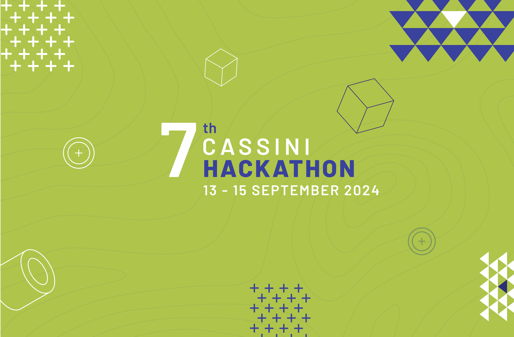
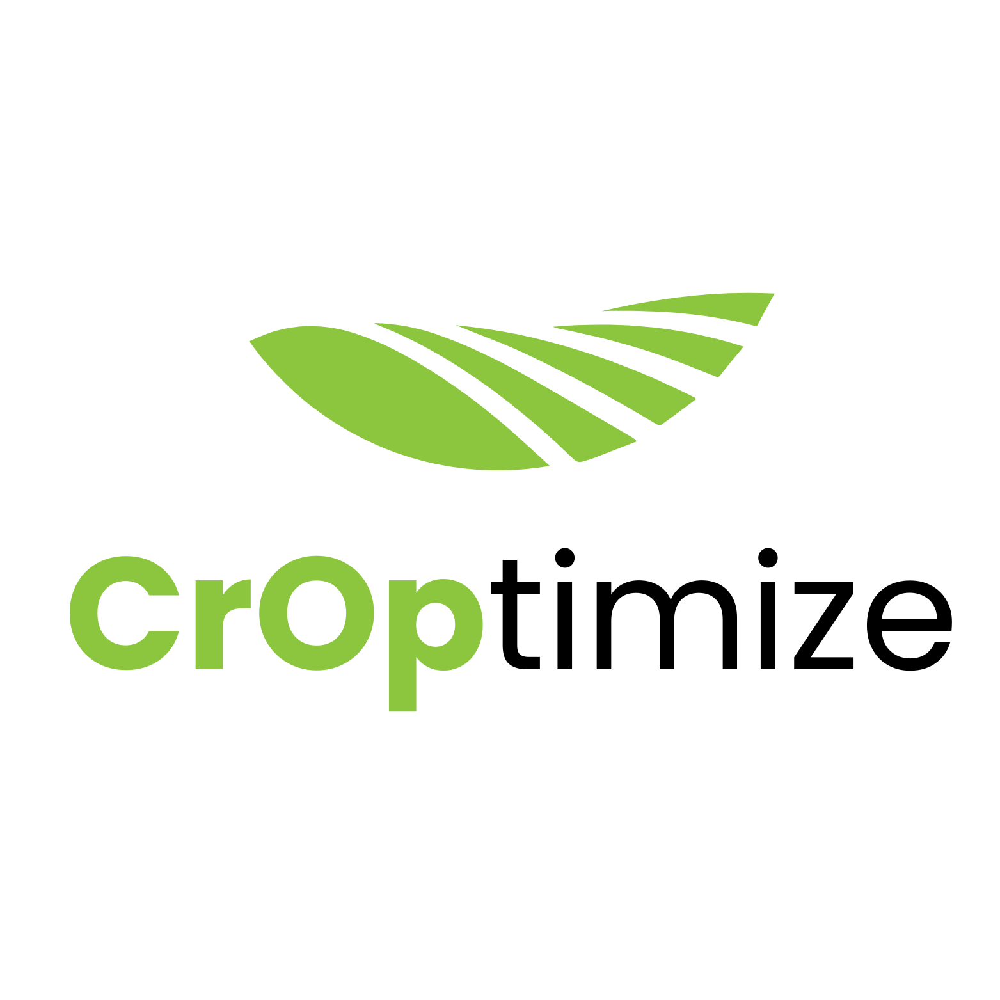
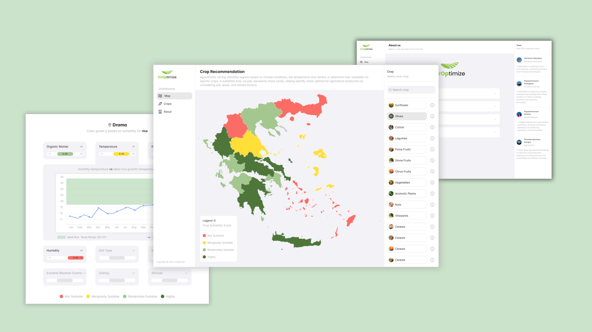

# 7th Cassini Hackathon

Team: DataMinds - Data & Tech Tools for a Sustainable Tomorrow

## Project: Crop Recommendation

### [1] 💎 Idea

Tell us about your idea here. Explain the problem and how you're going to solve it.

CrOptimize is a web platform designed to support farmers, agronomists, industries, and policymakers in selecting the most suitable crops for specific regions based on agroclimatic zoning. The platform leverages satellite and climate data to provide accurate, data-driven recommendations for crop selection, helping to mitigate the risks associated with traditional agricultural practices. Therefore, the platform helps to reduce resources needed to cultivate crops as well as mitigate risks that could damage or even destroy the crops, effectively wasting the resources already used.

Climate change, soil degradation, and resource limitations make it increasingly difficult for farmers to make informed decisions about crop selection. Traditional crops have been declining in performance due to climate change, while different types of crops are more suitable because of changes in soil and climate conditions.

CrOptimize addresses these challenges by combining satellite data, agricultural literature, and predictive algorithms to deliver optimized crop recommendations. The algorithm that powers the platform’s recommendations aims to reduce resource use (such as water and pesticides), increase yields, and contribute to more sustainable agricultural practices.

### [2] 🛰️ EU space technologies

Highlight the data, information or signals you are using/intend to use in your idea. Include some information on how this brings value to your idea

CrOptimize utilizes data from three main sources:

Copernicus Satellite Data (Sentinel-2 & Sentinel-3): This provides key environmental parameters, such as soil moisture, temperature, and vegetation indices. These data sets help assess the suitability of land for specific crops. With machine learning models (such as SVMs) and satellite data, we can predict data that would otherwise be impossible with just satellite data, such as salinity in soil.
Copernicus Climate Data Store (CDS): Provides climate indicators such as temperature, precipitation, and humidity. This data helps map regions into agroclimatic zones based on current and historical climate trends.
AgroApps API: Offers weather data.
Using these space technologies, CrOptimize can create detailed agroclimatic zoning maps that inform which crops can thrive in a region, optimizing agricultural productivity and sustainability.

#### Indexes Used

Normalized Difference Vegetation Index (NDVI): Quantifies vegetation health by measuring the difference between near-infrared (vegetation reflection) and red light (vegetation absorption).
Normalized Difference Water Index (NDWI): Monitors the water content in vegetation and soil.
Soil-Adjusted Vegetation Index (SAVI): Enhances the NDVI in areas with sparse vegetation by minimizing soil brightness influences.
Leaf Area Index (LAI): Measures the amount of leaf area per unit of ground area.
Integrated Use in Crop Recommendation Algorithm

The crop recommendation algorithm combines these diverse indexes into a multi-layered decision-making model. Key steps include:

Climatic Suitability: Based on temperature, moisture, and atmospheric data (Sentinel-1, Sentinel-3, AgroApps API).
Soil and Vegetation Health: Evaluated using Sentinel-2’s vegetation indexes and soil-adjusted indices.
Environmental Risks: Air quality, atmospheric gases, and weather hazards (Sentinel-5P and AgroApps) are factored in to reduce risks.
Resource Efficiency: Areas requiring fewer inputs (like water or fertilizer) are matched with crops needing fewer resources, enhancing sustainability.
This integrated approach ensures that CrOptimize delivers accurate and sustainable crop recommendations tailored to local conditions.

### Literature

Article Soil Salinity Mapping Using Machine Learning Algorithms with the Sentinel-2MSI in Arid Areas, ChinaJiaqiang Wang 1,2 , Jie Peng 3,* ,†, Hongyi Li 3 , Caiyun Yin 4 , Weiyang Liu 2 , Tianwei Wang 1,† and Huaping Zhang 4
Sentinel-2 Satellite Imagery-Based Assessment of Soil Salinity in Irrigated Rice Fieldsin PortugalRomeu Gerardo 1,2 and Isabel P. de Lima

### [3] Space for Environment & Green Transition

Which of the 3 challenges are you solving, and how does this contribute to support the transition to a sustainable economic system and the protection of the environment?

CrOptimize directly addresses the challenge of climate change mitigation by promoting more efficient and sustainable agricultural practices. Using satellite data, the platform helps identify areas where specific crops can grow with minimal resource input, thus reducing water usage, pesticide application, and soil degradation. CrOptimize contributes to a sustainable economic system by increasing the resilience of agricultural practices in the face of climate change. The platform supports the green transition by enabling policymakers to design better agricultural strategies that align with climate resilience and environmental protection goals, fostering long-term food security.

### [4] 🤼 Team

Tell us who is in your team, what role they have (e.g. coder/designer), and a 1-2 sentence bio

Team Members

Panagiotis (Panos) Papaemmanouil – Data Scientist (Team Coordinator - Point of Contact)

Panagiotis specializes in data science and algorithm development. He developed the crop recommendation engine by analyzing large datasets and combining machine learning techniques with agricultural literature. His work ensures the reliability and accuracy of CrOptimize's recommendations.

Napoleon Gartsonis – Full Stack Developer

Napoleon is responsible for both backend and frontend development. He ensures the platform's great performance, functionality, and user-friendliness by using the latest technologies and best practices. His expertise in software architecture, DevOps, and coding has been pivotal in bringing CrOptimize to life.

Anthimi Papaemmanouil – UI/UX Designer

Anthimi crafted the platform's user interface, focusing on creating a seamless and intuitive experience for users. Her design expertise ensures that CrOptimize is both aesthetically pleasing and accessible, even to users without technical backgrounds.

Giorgos Paraskevopoulos – Agronomist

Giorgos brings deep agricultural knowledge to the team. He provided critical input on crop types, soil management, and sustainable farming practices, ensuring that the platform's recommendations are grounded in real-world agronomy. His contributions help make CrOptimize a trusted tool for the agricultural sector.

Together, the team combines expertise in technology, data science, user experience, and agronomy to build a platform that promotes sustainable agriculture and contributes to the fight against climate change.

#### Technology 💻

Design and Prototypes - We used Figma to design everything from the initial drafts all the way to the clickable prototypes.

WebApp - we used the latest and hottest technologies to create a performant and visually striking web app. We chose to go with Next.js client-facing side of the application because of its excellent capabilities. The leaflet library for its dynamic and customizable maps and Tailwind CSS for styling and implementing the designs from Figma.

Recommendation API - We used Python to fetch and analyze data from the satellites and other provided APIs (like the one provided by AgroApps). We then combined the final dataset with agricultural knowledge and rules to generate crop recommendations per region. These recommendations will be delivered through a fastAPI backend.

### WebApp

- React
- Next.js
- Tailwind CSS
- Leaflet

### Backend

- Python

### Other Tools used

Copernicus Satellite Ecosystem
Copernicus Climate Data Store
SoilGrids.org
Statistical API (SentinelHub)
API AgroApps
GDAL Python Library
CDSAPI Python Library
QGIS.org

